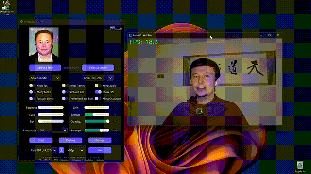
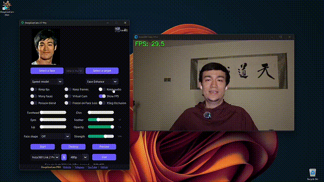

# DeepLiveCam PRO

**Real-time face swap and one-click video deepfake from a single image.**

Not just raw open-source software — a **complete PRO package**: ready Windows build, automatic simple install, author course, guides, extra tools, and help connecting to streaming services.

<p align="center">
  
  &nbsp;
  
</p>

<p align="center">
  <a href="https://sdcourse.tb.ru/deeplivecam">
    
  </a>
  &nbsp;
  <a href="https://t.me/R2D2Human">
    
  </a>
</p>

<p align="center">
  
  &nbsp;&nbsp;&nbsp;
  
  &nbsp;&nbsp;&nbsp;
  
</p>

<p align="center">
  <strong>Windows • CPU • NVIDIA • AMD</strong>
</p>

<p align="center">
  Builds and setups optimized for your hardware — no manual GitHub compile, no hunting for models and drivers.
</p>

---

### 🎬 Watch Demo Videos

<p align="center">
  <a href="https://www.youtube.com/watch?v=2SlFVwYyj6E">
    
  </a>
  &nbsp;
  <a href="https://www.youtube.com/watch?v=h8-JmDcJBFg">
    
  </a>
</p>

<p align="center">
  <a href="https://www.youtube.com/watch?v=2SlFVwYyj6E">
    
  </a>
  &nbsp;
  <a href="https://www.youtube.com/watch?v=h8-JmDcJBFg">
    
  </a>
</p>

<br>

<p align="center">
  <a href="https://www.youtube.com/watch?v=Ql_dXvfTNik">
    
  </a>
  &nbsp;
  <a href="https://www.youtube.com/watch?v=eiZvr-Ixm6g">
    
  </a>
  &nbsp;
  <a href="https://www.youtube.com/watch?v=Nvmb5aRTb4s">
    
  </a>
</p>

<p align="center">
  <a href="https://www.youtube.com/watch?v=Ql_dXvfTNik">
    
  </a>
  &nbsp;&nbsp;&nbsp;&nbsp;&nbsp;&nbsp;
  <a href="https://www.youtube.com/watch?v=eiZvr-Ixm6g">
    
  </a>
  &nbsp;&nbsp;&nbsp;&nbsp;&nbsp;&nbsp;
  <a href="https://www.youtube.com/watch?v=Nvmb5aRTb4s">
    
  </a>
</p>

<br>

<p align="center">
  <a href="https://www.youtube.com/watch?v=5RWTLjtAF3k">
    
  </a>
  &nbsp;
  <a href="https://www.youtube.com/watch?v=CHFoctr2cGs">
    
  </a>
  &nbsp;
  <a href="https://www.youtube.com/watch?v=O3vOZCaedYc">
    
  </a>
</p>

<p align="center">
  <a href="https://www.youtube.com/watch?v=5RWTLjtAF3k">
    
  </a>
  &nbsp;&nbsp;&nbsp;&nbsp;&nbsp;&nbsp;
  <a href="https://www.youtube.com/watch?v=CHFoctr2cGs">
    
  </a>
  &nbsp;&nbsp;&nbsp;&nbsp;&nbsp;&nbsp;
  <a href="https://www.youtube.com/watch?v=O3vOZCaedYc">
    
  </a>
</p>

**Click any preview or button to watch on YouTube**

---

### ✨ Features & Uses — everything is real-time

#### Mouth Mask

**Retain your original mouth for accurate movement using Mouth Mask**

<p align="center">
  
</p>

#### Face Mapping

**Use different faces on multiple subjects simultaneously**

<p align="center">
  
</p>

#### Your Movie, Your Face

**Watch movies with any face in real-time**

<p align="center">
  
</p>

#### Also included in the software

- Live webcam face swap (Telegram circles, Zoom, OBS, Twitch, YouTube, Chatroulette)
- Many Faces / multi-face modes
- Face enhancer options
- Live shows and content creation
- Works with virtual camera for streaming apps

---

### 📦 What you actually get (not “just software”)

This is a **full commercial package**, not a DIY GitHub install:

| Included | Description |
| --- | --- |
| ✅ **PRO software** | Ready-to-run build, no compile from source |
| ✅ **Automatic simple install** | Guided setup — no digging through GitHub, models, and dependency hell |
| ✅ **Author course** | Practical video lessons on DeepLiveCam and real workflows |
| ✅ **Guides & materials** | Step-by-step instructions for everyday use |
| ✅ **Extra tools / extras** | Additional software and helpers where needed for a complete workflow |
| ✅ **Service connections** | Help connecting to webcam apps, OBS, Zoom, Telegram and streaming setup |
| ✅ **Convenient daily use** | Optimized for creators — open, pick a face, go live |
| ✅ **Updates + Telegram support** | Priority help in chat when something breaks |

> Free open-source = assemble everything yourself.  
> **PRO = install → use → create content**, with course and support.

---

### 📊 Free / DIY vs PRO package

| Feature | Open-source DIY | **DeepLiveCam PRO** |
| --- | --- | --- |
| Real-time face swap | Manual install | ✅ Ready-to-run |
| Automatic simple setup | ❌ | ✅ |
| Author course + guides | ❌ | ✅ |
| Extra tools & materials | ❌ | ✅ |
| Help connecting services (OBS / Zoom / Telegram) | ❌ | ✅ |
| CPU • NVIDIA • AMD guidance | Community only | ✅ Included |
| Priority support | ❌ | ✅ Telegram |
| Updates as a product | Community | ✅ Included |

---

### 🛒 Get DeepLiveCam PRO

**Official product page (purchase):**  
[https://sdcourse.tb.ru/deeplivecam](https://sdcourse.tb.ru/deeplivecam)

<p align="center">
  <a href="https://sdcourse.tb.ru/deeplivecam">
    
  </a>
  &nbsp;
  <a href="https://t.me/R2D2Human">
    
  </a>
</p>

#### After purchase you receive

1. **PRO software** (ready Windows build)  
2. **Automatic / simple installation path**  
3. **Author course** + practice materials  
4. **Guides** for webcam, streaming, and everyday use  
5. **Help with connecting services** (OBS, Zoom, Telegram, virtual camera)  
6. **Access to updates** and **priority Telegram support**

> **Alternative payment:** if website payment fails (other countries, etc.), write on **Telegram** — crypto / transfer and other options.

**Telegram:** [https://t.me/R2D2Human](https://t.me/R2D2Human)

---

### 💻 Platforms & requirements

<p align="center">
  
  &nbsp;&nbsp;&nbsp;
  
  &nbsp;&nbsp;&nbsp;
  
</p>

<p align="center">
  <strong>Windows • CPU • NVIDIA • AMD</strong>
</p>

- **GPU (recommended):** NVIDIA from ~6 GB VRAM (RTX 2080 / 3060 / 3070 / 40xx / 50xx and similar)  
- **Also:** CPU path and AMD-oriented setups where applicable  
- **Webcam:** up to Full HD 1080p recommended  
- FPS depends on GPU (tensor cores, VRAM, overall power)

---

### 🛠️ Additional services

- Custom development and modifications  
- Streaming setup (OBS, Zoom, virtual camera)  
- Account / API help for related tools  
- Custom solutions for your projects  

**Contact:** [https://t.me/R2D2Human](https://t.me/R2D2Human)

---

### ⚠️ Important

This is a **commercial** product (PRO software + course + materials + support).  
Use only ethically: get consent for real people’s faces and label AI / deepfake content where required.

All rights reserved. © DeepLiveCam PRO

---

<p align="center">
  <a href="https://sdcourse.tb.ru/deeplivecam">
    
  </a>
  &nbsp;
  <a href="https://t.me/R2D2Human">
    
  </a>
</p>

<p align="center">
  <b>Having trouble paying on the website?</b><br>
  Message us on Telegram — we accept alternative payment methods.
</p>

---

### 🆓 Free (DIY) — manual installation

Open-source / free path for **advanced users only**.  
No ready build, no course, no automatic install, no priority support.

Prefer the easy way? → **[Buy DeepLiveCam PRO](https://sdcourse.tb.ru/deeplivecam)**

<details>
<summary><b>⬇️ Click to expand: free manual install · usage · models · CLI</b></summary>

<br>

#### Installation (Manual)

**Please be aware that the installation requires technical skills and is not for beginners. Consider the [PRO package](https://sdcourse.tb.ru/deeplivecam) instead.**

<details>
<summary>Click to see the process</summary>

### Installation

This is more likely to work on your computer but will be slower as it utilizes the CPU.

**1. Set up Your Platform**

-   Python (3.14 recommended; 3.11-3.14 supported)
-   pip
-   git
-   [ffmpeg](https://www.youtube.com/watch?v=OlNWCpFdVMA) - ```iex (irm ffmpeg.tc.ht)```
-   [Visual Studio 2022 Runtimes (Windows)](https://visualstudio.microsoft.com/visual-cpp-build-tools/)

**2. Clone the Repository**

```bash
git clone --depth 1 https://github.com/Promande/DeepLiveCam-PRO.git
cd DeepLiveCam-PRO
```

**3. Download the Models**

1. [GFPGANv1.4](https://huggingface.co/hacksider/deep-live-cam/resolve/main/GFPGANv1.4.onnx)
2. [inswapper_128_fp16.onnx](https://huggingface.co/hacksider/deep-live-cam/resolve/main/inswapper_128_fp16.onnx)

Place these files in the "**models**" folder.

**4. Install Dependencies**

We highly recommend using a `venv` to avoid issues.


For Windows:
```bash
python -m venv venv
venv\Scripts\activate
pip install -r requirements.txt
```
For Linux:
```bash
# Ensure you use the installed Python 3.14
python3 -m venv venv
source venv/bin/activate
pip install -r requirements.txt
```

**For macOS:**

Apple Silicon (M1 through M5) requires specific setup:

```bash
# Install Python 3.14
brew install python@3.14

# Install tkinter package (required for the GUI)
brew install python-tk@3.14

# Create and activate virtual environment with Python 3.14
python3.14 -m venv venv
source venv/bin/activate

# Install dependencies
pip install -r requirements.txt
```

** In case something goes wrong and you need to reinstall the virtual environment **

```bash
# Deactivate the virtual environment
rm -rf venv

# Reinstall the virtual environment
python -m venv venv
source venv/bin/activate

# install the dependencies again
pip install -r requirements.txt

# gfpgan and basicsrs issue fix
pip install git+https://github.com/xinntao/BasicSR.git@master
pip uninstall gfpgan -y
pip install git+https://github.com/TencentARC/GFPGAN.git@master
```

**Run:** If you don't have a GPU, you can run using `python run.py`. Note that initial execution will download models (~300MB).

### GPU Acceleration

**CUDA Execution Provider (Nvidia)**

1. Install [CUDA Toolkit 12.8.0](https://developer.nvidia.com/cuda-12-8-0-download-archive)
2. Install [cuDNN v8.9.7 for CUDA 12.x](https://developer.nvidia.com/rdp/cudnn-archive) (required for onnxruntime-gpu):
   - Download cuDNN v8.9.7 for CUDA 12.x
   - Make sure the cuDNN bin directory is in your system PATH
3. Install dependencies:

```bash
pip install -U torch torchvision torchaudio --index-url https://download.pytorch.org/whl/cu128
pip uninstall onnxruntime onnxruntime-gpu
pip install onnxruntime-gpu==1.21.0
```

3. Usage:

```bash
python run.py --execution-provider cuda
```

**CoreML Execution Provider (Apple Silicon)**

Apple Silicon (M1 through M5) specific installation:

1. Make sure you've completed the macOS setup above using Python 3.14.
2. No extra install step is needed — `requirements.txt` pulls the official
   `onnxruntime` build, whose macOS wheels ship the CoreML execution provider.
   If you previously installed the unmaintained `onnxruntime-silicon` fork,
   remove it first, as it shadows the real package:

```bash
pip uninstall onnxruntime-silicon
pip install -r requirements.txt
```

3. Usage:

```bash
python3.14 run.py --execution-provider coreml
```

**Important Notes for macOS:**
- Python 3.11 is the minimum (onnxruntime dropped 3.10); 3.14 is recommended
- Always run with `python3.14` command not just `python` if you have multiple Python versions installed
- If you get error about `_tkinter` missing, reinstall the tkinter package: `brew reinstall python-tk@3.14`
- If you get model loading errors, check that your models are in the correct folder
- If you encounter conflicts with other Python versions, consider uninstalling them:
  ```bash
  # List all installed Python versions
  brew list | grep python

  # Uninstall conflicting versions if needed
  brew uninstall --ignore-dependencies python@3.11

  # Keep only Python 3.14
  brew cleanup
  ```

**CoreML Execution Provider (Apple Legacy)**

1. Install dependencies:

```bash
pip uninstall onnxruntime onnxruntime-coreml
pip install onnxruntime-coreml==1.21.0
```

2. Usage:

```bash
python run.py --execution-provider coreml
```

**DirectML Execution Provider (Windows)**

1. Install dependencies:

```bash
pip uninstall onnxruntime onnxruntime-directml
pip install onnxruntime-directml==1.21.0
```

2. Usage:

```bash
python run.py --execution-provider directml
```

**OpenVINO™ Execution Provider (Intel)**

1. Install dependencies:

```bash
pip uninstall onnxruntime onnxruntime-openvino
pip install onnxruntime-openvino==1.21.0
```

2. Usage:

```bash
python run.py --execution-provider openvino
```
</details>

#### Usage

**1. Image/Video Mode**

-   Execute `python run.py`.
-   Choose a source face image and a target image/video.
-   Click "Start".
-   The output will be saved in a directory named after the target video.

**2. Webcam Mode**

-   Execute `python run.py`.
-   Select a source face image.
-   Click "Live".
-   Wait for the preview to appear (10-30 seconds).
-   Use a screen capture tool like OBS to stream.
-   To change the face, select a new source image.

#### Download all models (Hugging Face)
- [**Download models here**](https://huggingface.co/hacksider/deep-live-cam/tree/main)

#### Command Line Arguments (Unmaintained)

```
options:
  -h, --help                                               show this help message and exit
  -s SOURCE_PATH, --source SOURCE_PATH                     select a source image
  -t TARGET_PATH, --target TARGET_PATH                     select a target image or video
  -o OUTPUT_PATH, --output OUTPUT_PATH                     select output file or directory
  --frame-processor FRAME_PROCESSOR [FRAME_PROCESSOR ...]  frame processors (choices: face_swapper, face_enhancer, ...)
  --keep-fps                                               keep original fps
  --keep-audio                                             keep original audio
  --keep-frames                                            keep temporary frames
  --many-faces                                             process every face
  --map-faces                                              map source target faces
  --mouth-mask                                             mask the mouth region
  --video-encoder {libx264,libx265,libvpx-vp9}             adjust output video encoder
  --video-quality [0-51]                                   adjust output video quality
  --live-mirror                                            the live camera display as you see it in the front-facing camera frame
  --live-resizable                                         the live camera frame is resizable
  --max-memory MAX_MEMORY                                  maximum amount of RAM in GB
  --execution-provider {cpu} [{cpu} ...]                   available execution provider (choices: cpu, ...)
  --execution-threads EXECUTION_THREADS                    number of execution threads
  -v, --version                                            show program's version number and exit
```

Looking for a CLI mode? Using the -s/--source argument will make the run program in cli mode.

</details>

